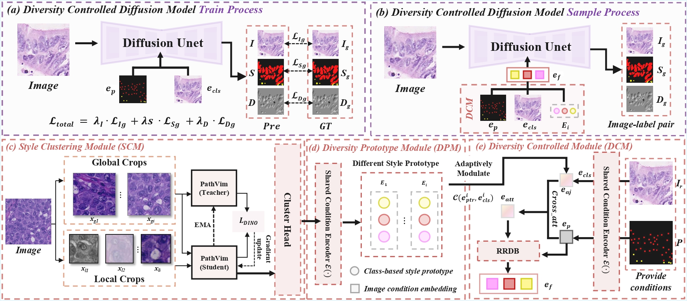

# DCDiffusion

Official implementation of **"[Diversity Controlled Diffusion Model for Nuclear Instance Segmentation in Pathology](https://ieeexplore.ieee.org/document/11614762)"**  
(IEEE Transactions on Multimedia).

DCDiffusion is a diffusion model-based data augmentation framework designed for medical image nuclei segmentation tasks. This framework helps improve the performance of downstream segmentation models by generating high-quality synthetic training data.

## Method Overview



## Project Overview

This project leverages state-of-the-art diffusion model techniques to generate synthetic medical image nuclei data for data augmentation. Through joint training of image and label generation processes, DCDiffusion can produce realistic nuclei images along with their corresponding segmentation masks and type labels, effectively addressing the problem of scarce medical image data.

### Core Features

- **Data Generation**: Use diffusion models to generate high-quality nuclei images and annotations
- **Data Augmentation**: Provide additional training data for downstream tasks
- **Joint Generation**: Simultaneously generate images, instance segmentation masks, and type labels
- **Performance Evaluation**: Provide downstream evaluation metrics from the paper

## Supported Datasets

The DCDiffusion framework supports the following medical image datasets:

- **[CoNSeP](https://websignon.warwick.ac.uk/origin/slogin?shire=https%3A%2F%2Fwarwick.ac.uk%2Fsitebuilder2%2Fshire-read&providerId=urn%3Awarwick.ac.uk%3Asitebuilder2%3Aread%3Aservice&target=https%3A%2F%2Fwarwick.ac.uk%2Ffac%2Fcross_fac%2Ftia%2Fdata%2Fhovernet%2F&status=notloggedin)**: Colorectal tissue nuclei dataset
- **[GLySAC](https://drive.google.com/file/d/1g1_xYFWgp3cRLKrlSwD2U5JDjooC0yHp/view?pli=1)**: Gastric cancer tissue nuclei dataset
- **[PUMA](https://puma.grand-challenge.org/dataset/)**: Melanoma tissue nuclei dataset

### Dataset Information

Dataset supports classification of multiple nuclei types:

**CoNSeP Dataset Classes**:
- Background
- Others
- Inflammatory
- Epithelial
- Spindle-shaped cells

**GLySAC and PUMA datasets contain corresponding tissue-specific nuclei types**

## PUMA Dataset Split

The project includes the official PUMA dataset split:

```
data/puma/
├── train.txt          # Training set image list (5655 bytes)
└── test.txt           # Test set image list (1452 bytes)
```

- **Training set**: Used for training diffusion models and downstream segmentation models
- **Test set**: Used for evaluating generated data quality and downstream task performance

## Project Structure

```
work3/
├── code/                        # Source code directory
│   ├── datasets/                # Dataset loaders
│   │   ├── consep_sme.py       # CoNSeP dataset
│   │   ├── glysac_sme.py       # GLySAC dataset
│   │   ├── puma_sme.py         # PUMA dataset
│   │   └── ...
│   ├── imagen_pytorch/          # Diffusion model implementation
│   │   ├── imagen_pytorch.py   # Core Imagen model
│   │   ├── joint_imagen*.py   # Joint image-label generation
│   │   └── trainer.py          # Trainer
│   └── train.py                # Training script
├── data/                        # Data directory
│   └── puma/                   # PUMA dataset split
│       ├── train.txt           # Training set list
│       └── test.txt            # Test set list
└── val/                         # Evaluation scripts directory
    ├── compute_stats_vary_12.17_single_type.py  # Downstream metrics evaluation
    └── sh/                     # Evaluation script collection
        ├── metrics*.sh        # Metrics calculation for each dataset
        └── run_tile*.sh       # Tile-based inference scripts
```

## Downstream Evaluation Metrics

The project implements downstream task evaluation metrics used in the paper to measure the performance improvement of generated data on segmentation models:

### Core Evaluation Metrics

1. **Dice Coefficient** (`get_dice_1`)
   - Measures segmentation overlap
   - Supports instance-level and type-level computation

2. **AJI (Aggregated Jaccard Index)** (`get_fast_aji`)
   - Aggregated Jaccard index
   - Considers both detection and segmentation quality

3. **AJI+** (`get_fast_aji_plus`)
   - Improved aggregated Jaccard index
   - More accurate boundary evaluation

4. **PQ (Panoptic Quality)** (`get_fast_pq`)
   - Panoptic quality evaluation
   - Includes Detection Quality (DQ) and Segmentation Quality (SQ)

5. **Type-specific Metrics**
   - Independent performance evaluation for each nuclei type
   - Supports multi-type average metrics calculation

### Evaluation Functions

`val/compute_stats_vary_12.17_single_type.py` provides comprehensive evaluation functions:

- **Instance Statistics**: `run_nuclei_inst_stat()` - Instance-level segmentation evaluation
- **Type Statistics**: `run_nuclei_type_stat()` - Type classification evaluation
- **Comprehensive Evaluation**: `run_nuclei_fast_instance_()` - Joint evaluation of multiple metrics
- **Single-type Evaluation**: `run_nuclei_fast_instance_single()` - Single-type detailed analysis

## Data Generation Pipeline

### 1. Train Diffusion Model
```bash
python train.py --dataset consep --num_iters 300000
```

### 2. Generate Synthetic Data
Use trained model to generate image-label pairs

### 3. Downstream Task Training
Train segmentation model using original data + generated data

### 4. Performance Evaluation
Use provided evaluation scripts to measure performance improvement

## Model Architecture

DCDiffusion adopts a joint generation architecture:

- **JointImagen**: Joint model for simultaneous image and label generation
- **UNet backbone**: Multi-scale feature extraction network
- **Diffusion Process**: DDPM/DDIM sampling to generate high-quality data
- **Conditional Generation**: Conditional generation based on dataset type and nuclei type

## Evaluation Script Usage

### CoNSeP Dataset Evaluation
```bash
cd val/sh
bash metrics_f_consep.sh
```

### GLySAC Dataset Evaluation
```bash
cd val/sh
bash metrics_f_glysac.sh
```

### PUMA Dataset Evaluation
```bash
cd val/sh
bash metrics_f_puma.sh
```

## Technical Features

- **High-Quality Generation**: Advanced diffusion models ensure generated data quality
- **Multi-Dataset Support**: Unified framework supporting three mainstream datasets
- **Comprehensive Evaluation**: Provides all downstream evaluation metrics from the paper
- **Modular Design**: Easy to extend to other medical image datasets
- **Performance Optimization**: Supports distributed training and inference

## Application Scenarios

DCDiffusion is particularly suitable for the following scenarios:

- **Few-Shot Learning**: Augment training sets when labeled data is scarce
- **Data Imbalance**: Balance sample numbers across different classes and types
- **Model Generalization**: Improve model generalization through diverse data
- **Domain Adaptation**: Generate synthetic data in target domain style
- **Performance Enhancement**: Preprocessing step to improve downstream segmentation model performance

## Experimental Validation

The project includes comprehensive experimental validation:

1. **Baseline Comparison**: Segmentation model performance trained on original data
2. **Augmentation Effect**: Performance improvement after using generated data
3. **Ablation Studies**: Effect comparison of different generation strategies
4. **Type Analysis**: Performance improvement for each nuclei type

## Dependencies

Main dependencies:
- PyTorch & torchvision
- PIL/Pillow
- numpy & scipy
- einops
- kornia
- tqdm
- wandb (optional, for experiment tracking)

## File Description

### Core Code
- `train.py`: Diffusion model training script
- `imagen_pytorch/`: Diffusion model core implementation
- `datasets/`: CoNSeP, GLySAC, PUMA dataset loaders

### Evaluation Tools
- `val/compute_stats.py`: Paper metrics implementation
- `val/sh/metrics*.sh`: Evaluation scripts for each dataset
- `val/sh/run_tile*.sh`: Tile-based inference scripts

### Data Files
- `data/puma/train.txt`: PUMA training set split
- `data/puma/test.txt`: PUMA test set split
